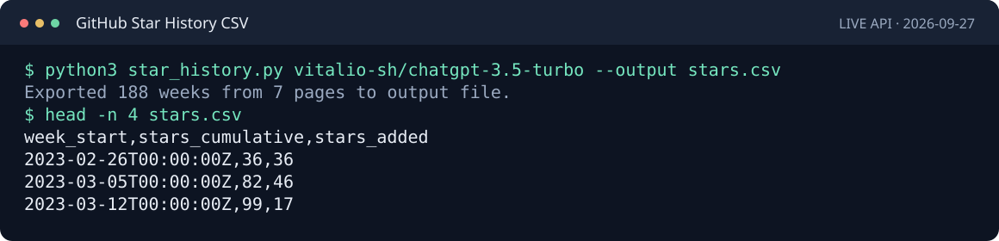

# GitHub Star History CSV

Export GitHub repository star history to CSV with one Python command.

**No dependencies · No token for public repos · CSV for spreadsheets**



## Quickstart

Requires **Python 3.9+**. Pass `owner/repo` and choose the output file:

```sh
git clone https://github.com/vitalio-sh/github-star-history-csv.git
cd github-star-history-csv
python3 star_history.py vitalio-sh/chatgpt-3.5-turbo --output stars.csv
```

## Why use this?

- Import repository star history into **Google Sheets or Excel**.
- Compare weeks of growth using **`stars_added`**, without calculating differences.
- Use the cumulative series in **pandas or your own analysis**.

## Example output

Real anonymous run on **2026-09-27**:

```text
Exported 188 weeks from 7 pages to output file.
```

The first four lines (`head -n 4 stars.csv`):

```csv
week_start,stars_cumulative,stars_added
2023-02-26T00:00:00Z,36,36
2023-03-05T00:00:00Z,82,46
2023-03-12T00:00:00Z,99,17
```

[Full CSV](examples/stars.csv) · [Recorded command and output](docs/demo.txt) · [API verification](docs/api-verification.md)

## CSV contract

| Column | Meaning |
| --- | --- |
| `week_start` | Start of GitHub's weekly bucket, preserving its timestamp in UTC notation. |
| `stars_cumulative` | Sum of weekly API totals **through and including this week**. |
| `stars_added` | API-reported additions in this week (`total`), copied directly. |

Rows run oldest to newest. Explicit zero weeks are kept; missing or inconsistent data causes an error. An empty history produces only the header and a warning.

A row's cumulative count includes the labelled week; it is **not the count at that week's start**. GitHub's calendar boundaries may differ from UTC. The newest week is incomplete, and these totals do not establish an exact historical balance after unstars. See [API details and limits](docs/usage.md#history-and-api-limits).

## Useful options

```sh
# Send CSV to stdout; diagnostics stay on stderr.
python3 star_history.py vitalio-sh/chatgpt-3.5-turbo --output -

# Replace an existing file explicitly.
python3 star_history.py vitalio-sh/chatgpt-3.5-turbo --output stars.csv --force
```

Existing files are protected by default. All pages are fetched before output; file writes are atomic. `--max-pages` bounds requests (default 100), and `--timeout` sets the socket timeout (default 20 seconds). `--help` lists all options.

Private repositories or higher API quotas require an environment variable, `GITHUB_TOKEN`; fine-grained tokens need repository access and **Metadata: read**. See [authentication](docs/usage.md#authentication-and-access) and [common errors](docs/usage.md#troubleshooting). Public exports require no token.

Exit codes: **0** success, **1** API/network/output error, **2** invalid arguments, **130** interruption.

## Use in pandas

If pandas is already installed (optional):

```python
import pandas as pd

stars = pd.read_csv("examples/stars.csv", parse_dates=["week_start"])
print(stars[["week_start", "stars_added"]].head())
```

For Excel or Google Sheets, import the CSV as UTF-8 with a comma delimiter. [More examples](docs/usage.md#examples).

## Development

```sh
python3 -m unittest discover -s tests -v
python3 scripts/check_release.py
```

The exporter and offline tests use only Python's standard library. See [validation results](docs/validation.md), [demo reproduction](docs/usage.md#development-and-verification), and [release instructions](RELEASE.md). Private access and Windows have not been tested live.

## Related tool

[Star History](https://github.com/star-history/star-history) offers a broader graphical workflow. This project focuses on CSV exports for spreadsheets and Python analysis.

## License

[MIT](LICENSE) © 2026 vitalio-sh. An independent project; GitHub is a trademark of its owner. The demo contains public aggregate API data, with no stargazer identities.
